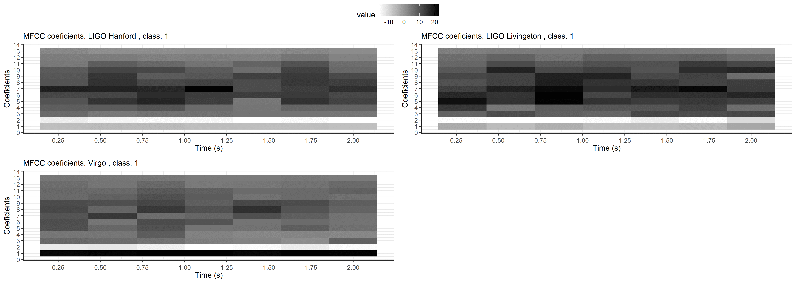
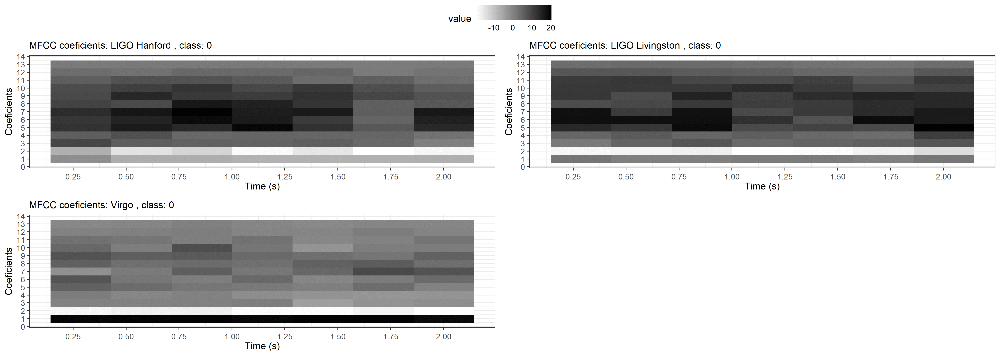
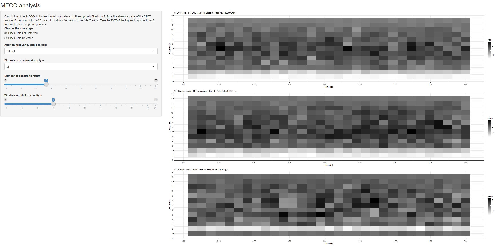
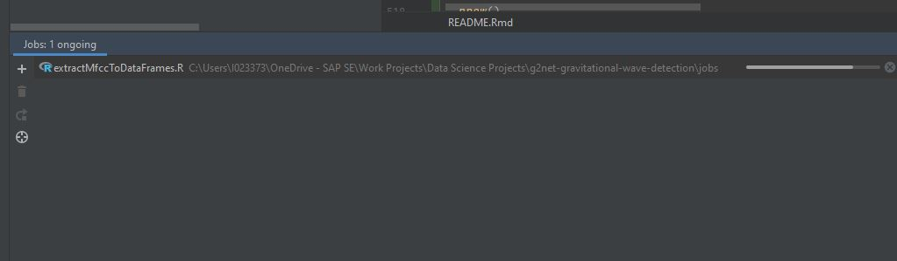

# Kaggle's competition:
[](https://www.kaggle.com/c/g2net-gravitational-wave-detection/overview)
The competition is about detecting gravitational waves in three signals coming from three interferometre

We are interested in this competition, as the waves looks like a sound, and we can apply some sound engineering technics, and some digital signal processing to extract some features from the data, before apply some deep learning to the models to train to predict the class of the wave
- '0': if there is no sound analysis detected
- '1': if there is one

the signal consist of three waves recording in three locations:
- LIGO Hanford,
- LIGO Livingston
- Virgo

the challenge of this data is that it needs many disciplines including physics, digital signal processing, sound engineering and data science, in my previous studies when I was junger, I studied some electrical engeneering, it is a vey nice opportunity to remember some lessons learned at that time,


it is kind of dream to work with such data, for a developer like me, where getting data at work is some times impossible due to some confidentiality closes, where we can not freely to get the data to apply some data science algorithms

we will use sound analysis to study these gravitational waves,

Nice book about sound analysis using R [](https://link.springer.com/book/10.1007/978-3-319-77647-7), it shows many examples for plotting spectorgrams


We group the function we build in [file](functions.R)
```{r setup, include=FALSE, echo = FALSE, warning = FALSE}
knitr::opts_chunk$set(echo = TRUE)

source('functions.R')
source("kerasModels.R")
```

## R Markdown

Read data from the npy file, and plot them as time series with ggplot, every npy file contains the three waves

```{r  }
library(RcppCNPy)
library(tidyverse)
library(tuneR)
library(seewave)

"00000e74ad.npy" %>% npyLoad() -> imat

imat %>%
  t() %>%
  as.data.frame() %>%
  rename( x =V1 , y = V2 , z = V3) %>%
  add_column( index = 1:(imat %>% ncol()) ) %>%
  gather( key, value , -index ) %>%
  ggplot( aes (y = value, x = index) ) +
  geom_line() +
  facet_grid(rows = vars(key)) +
  xlab("Time") + ylab("Intensity")


```


we plot the spectrogram of the time series wave, and we limit the frequecy boundary of the plot from 0 to 0.03 khz

```{r  FrequencyAnlysis}
"00001f4945.npy" %>% readWaveFromNpy(1)  %>% spec( flim = c(0,0.03) )


```


## Including Plots

You can also embed plots, for example:

```{r  TimeFrequency1}
"00001f4945.npy" %>% spectreTest()
```

similar to [example](https://rug.mnhn.fr/seewave/spec.html)
the code was copied form the above source, we have refactored it into different functions, to avoid occyping the memory with temporarly useless data
the result we are looking is to plot some graphs.

```{r TimeFrequency2}
 "00001f4945.npy" %>% readWaveFromNpy(2) %>% showPlots()

```


# shiny app for spectral analysis:
we use shiny applications in this project to explore visually the differnt parameters of the R functions and algorithms, this allow to find quickly the right tunning, and also understand the effect of every parameter, we use drop down list with different possible parameters, as well silders,
can be found in [folder](spectralAnalysisShinyApp)


# MFCC coefficients:


Calculate Frequency conversion and Filtering:
will apply some sound technique analysis, as frequencies domain is closer

```{r waveAuditorySpectrumScale}
"00001f4945.npy" %>% readWaveFromNpy(1) %>% scaleAndPlotAudSpecToMelFrequencies()
"00001f4945.npy" %>% readWaveFromNpy(2) %>% scaleAndPlotAudSpecToMelFrequencies()
"00001f4945.npy" %>% readWaveFromNpy(3) %>% scaleAndPlotAudSpecToMelFrequencies()

```


Cepstral Coefficients

```{r Cepstral image}

"00001f4945.npy" %>% readWaveFromNpy(1) %>% cepstralCoefs() %>% .$cep %>% image()
"00001f4945.npy" %>% readWaveFromNpy(2) %>% cepstralCoefs() %>% .$cep %>% image()
"00001f4945.npy" %>% readWaveFromNpy(3) %>% cepstralCoefs() %>% .$cep %>% image()

```
scale and plot

```{r scaleAndPlotCepstralCoefs}


"00001f4945.npy" %>% readWaveFromNpy(1) %>% scaleAndPlotCepstralCoefs()
"00001f4945.npy" %>% readWaveFromNpy(2) %>% scaleAndPlotCepstralCoefs()
"00001f4945.npy" %>% readWaveFromNpy(3) %>% scaleAndPlotCepstralCoefs()

```

MFCC coeficients


```{r calculate mfcc and plot image}


"00001f4945.npy" %>% readWaveFromNpy(1) %>% mfccCoefs() %>% image()
"00001f4945.npy" %>% readWaveFromNpy(2) %>% mfccCoefs() %>% image()
"00001f4945.npy" %>% readWaveFromNpy(3) %>% mfccCoefs() %>% image()
```

use melfcc function from tuneR package to calculate the coeficients

```{r iamgesMfcc}


"00001f4945.npy" %>% readWaveFromNpy(1) %>% mfccCoefs2() %>% .$cepstra %>% image()
"00001f4945.npy" %>% readWaveFromNpy(2) %>% mfccCoefs2() %>% .$cepstra %>% image()
"00001f4945.npy" %>% readWaveFromNpy(3) %>% mfccCoefs2() %>% .$cepstra %>% image()

```


Scale MFCC 13 coefficients and time to original and plot values in gery scale:

```{r scalePlotMfcc }


"00001f4945.npy" %>% readWaveFromNpy(1) %>% scalePlotMfcc()
"00001f4945.npy" %>% readWaveFromNpy(2) %>% scalePlotMfcc()
"00001f4945.npy" %>% readWaveFromNpy(3) %>% scalePlotMfcc()

```


Use ggplot for the graphs 'geom_raster'

```{r ggplotMFCC }
"00001f4945.npy" %>% readWaveFromNpy(1)   %>% ggplotMFCC()
```

Generate csv file with name of .npy files, with their paths and category type (1 : wave detected, 0: wave not detected )
```{r genrateCSVFileForWavesInfo, eval = FALSE}

"../machineLearningData/gravitationalWaves/train" %>% generateTrainLabels()


```

Produce animation of images of time frequency graphs using sample of gravitational waves are detected, we will try with animation to detect or see any feature from the data visual,
the first sequence of MFCC coefficients will be with only class data '1', then class '0' and finally we produce a sequence switching between class 1 and class 0, so to detect any difference visually as said.


Sequence of 20 images of class 1, we store them in [folder](otherPictures/coefficientsClass1):
```{r imagesClass1, eval = FALSE , echo = FALSE}

for( index in 1:20 ){
  "../machineLearningData/gravitationalWaves/train/file_labels.csv" %>%
    plotMFCC3Waves( 1 ) %>%
    ggsave( filename = sprintf("otherPictures/coefficientsClass1/coefficients%s.PNG", index),
            device = "png")
}


```

[](https://www.nagraj.net/notes/gifs-in-r/)


We produce the animation for the 20 images:

```{r animationClass1, eval = FALSE}
"otherPictures/coefficientsClass1" %>% animateMFCCCoefPlots(waveClass = 1)
```

We can show the produced animation



we produce also images of coefficients of class 0, and we store them in [folder](otherPictures/coefficientsClass0):
```{r  produceImagesOfClass0, echo = FALSE,eval = FALSE}

for( index in 1:20 ){
  "../machineLearningData/gravitationalWaves/train/file_labels.csv" %>%
    plotMFCC3Waves( 0 ) %>%
    ggsave( filename = sprintf("otherPictures/coefficientsClass0/coefficients%s.PNG", index),
            device = "png")
}


```


we produce animation with 5 of produced images:

```{r animationClasse_0, eval = FALSE}
"otherPictures/coefficientsClass0" %>% animateMFCCCoefPlots(waveClass = 0)

```

We can show the produced animation


let's produce animation with mix of coefficients pictures for class: '1' and '0'

```{r  animationClasse_1_and_0, eval = FALSE}
 "otherPictures/coefficientsClass0" %>%
  list.files(full.names = TRUE) %>%
  .[1:3] %>%
  rbind( "otherPictures/coefficientsClass1" %>% list.files(full.names = TRUE) %>% .[1:3] ) %>%
  c(.) %>%
  savePicturesAsAnimation( waveClass = 10 )
```

the animation of two classes 1 and 0 ( we used 3 images of each class)



# shiny application for MFCC coefficients:
to understand the different parterres of MFCC calculation, we build another small shinny application:
- the user can change the parameters to see a better visualization
- to find suitable values, of the algorithm that we can use later
the application is located at [folder](mfccAnalysisShinyApp) it can run with file 'run.R'

this is a screenshot of the application, to see how it looks like:



# Reduce dimensions of MFCC matrix for better visualization
Visually it is hard to see the difference between the waves containing gravitation and the others, even with the animations techniques, it is still undistinguished,

let's do more:
- we calculate the MFCC coefficients with suitable parameters found with shiny application
- repeat the above step for many waves
- reduce the dimension of the MFCC matrices using PCA
- plot the scatter plot that show in two different colors the two classes of data
this will be a good indicator whether MFCC features can be used to train models


We take randomly a given number of waves for example 100 from both classes of the data, we do the following transformations for the data:
- Read the wave data
- Calculate MFCC matrix of dimension 19 x 64 ( number of coefficients is 19, window length is 64 for the signal)
- we convert the every matrix of signals to one vector of 1216
- perform principal component analysis for both samples of data, matrix of ( 200 x 1216 )
- take the two most significant vectors of resulted PCA
- plot a scatter plot with different colors for the data classes


```{r }


```


```{r }
getSamleOfMixClasses(1000 , 1 )%>% ggplot( aes( x = PC1, y = PC2 ) ) + geom_point( aes( colour = target)  )

```


```{r }
getSamleOfMixClasses(1000 , 2 )%>% ggplot( aes( x = PC1, y = PC2 ) ) + geom_point( aes( colour = target)  )

```


```{r }
getSamleOfMixClasses(1000 , 3 )%>% ggplot( aes( x = PC1, y = PC2 ) ) + geom_point( aes( colour = target)  )

```


for better visualization we tsne instead of PCA

```{r }


getSamleOfMixClassesTsne( 1000 , 1 , maxDim = 2 ) %>% ggplot( aes( x = V1, y = V2 ) ) + geom_point( aes( colour = target)  )

```


```{r }
getSamleOfMixClassesTsne( 1000 , 2 , maxDim = 2 ) %>% ggplot( aes( x = V1, y = V2 ) ) + geom_point( aes( colour = target)  )

```


```{r }
getSamleOfMixClassesTsne( 1000 , 3 , maxDim = 2 ) %>% ggplot( aes( x = V1, y = V2 ) ) + geom_point( aes( colour = target)  )

```


3D plot

```{r }

getSamleOfMixClassesTsne( 1000 , 1, maxDim = 3 ) %>% scatterPlot3DDimReduction()


```


```{r }

getSamleOfMixClassesTsne( 1000 , 2, maxDim = 3 ) %>% scatterPlot3DDimReduction()


```

```{r }

getSamleOfMixClassesTsne( 1000 , 3, maxDim = 3 ) %>% scatterPlot3DDimReduction()


```


In the above 3d graphs we were checking if we visually we can see any clusters, or any way to separate the red and white points,
it looks not easy at 3D dimension,
we will now apply some neural network model, to predict the class of the wave, we can use to train the models and validate them:
- Directly the 'melfcc' matrices
- Reduced dimensions using of Tsne transformation


# Machine learning

## Deep learning with keras


we check keras installation

we have 3 waves, and every wave needs 19 x 64 matrix, and we have a total 560000 rows

19 x 64 x 3 will be the input format of neural network,

we build a function that can convert any set of waves to the input of our neural network,
it takes as paramters the number of waves that we want to convert, then it will take a samples of that number of waves randomly
it transform every wave to a matrix of 19 x 64

```{r }

convertToNeuralInputShape <- function( numberSamples) {

  "../machineLearningData/gravitationalWaves/train/file_labels.csv" %>%
    getListOfWaves() %>%
    sample_n( size = numberSamples ) %>%
    select(-X) %>%
    select(filePath) %>%
    unlist() %>%
    as.character() %>%
    lapply(
      function(path) {
        wave1 <- path %>%
          readWaveFromNpy(1)  %>%
          calCulateMFCCMatrix( ncep = 19,wl = 64, fbtype="htkmel" , dcttype="t3" )
        wave2 <- path %>%
          readWaveFromNpy(2) %>%
          calCulateMFCCMatrix( ncep = 19,wl = 64, fbtype="htkmel" , dcttype="t3" )
        wave3 <- path %>%
          readWaveFromNpy(3) %>%
          calCulateMFCCMatrix( ncep = 19,wl = 64, fbtype="htkmel" , dcttype="t3" )

        cbind(wave1,wave2,wave3) %>% array(c(19,64,3))

      } ) %>%
    array(c(numberSamples,19,64,3))

}

```


let's measure the size of resulted matrix for every wave:

```{r }
convertToNeuralInputShape(1)%>% utils::object.size( ) %>% format('Mb')

```

so, 560 000 waves will need: 6 x 10^13 bytes ->  60 TeraBytes, this is very high to hold in memory and train the neural network,

to solve the problem we will need a kind of data streaming, to read not all the data, but smaller amounts and loop on them util we finish the learning

Keras hopefully has such way of learning by loading smaller chuncks of training data 'keras::fit_generator'

[python example](https://gist.github.com/fchollet/0830affa1f7f19fd47b06d4cf89ed44d)
Good explanation for [r example](https://keras.rstudio.com/articles/faq.html#how-can-i-use-keras-with-datasets-that-dont-fit-in-memory)
[r example](https://stackoverflow.com/questions/53357901/using-a-custom-r-generator-function-with-fit-generator-keras-r)


To start the neural network model, we will copy [start_example](https://github.com/rstudio/keras/blob/master/vignettes/examples/cifar10_cnn.R)
we change its input to adapt it to the output of our function calculating MELFCC function 19x63 or 19x63x3 depending on of we use the 3 signals, or only one
the output of the network will be 1 dense layer finishing with softmax activation,

two ways to model that we can see for the moment:
- use three independent models, every one will be trained by one wave, at the end we bring them together using ensemble
- use one model, that we train by the three signals of the three stations


One model for one wave location:
it is taking a very huge time to train every model, for the training and validation, we load the data from files, and not once, we do that in streaming
functions:
dataGeneratorFromFiles1Wave()
dataValidationGeneratorFromFiles1Wave()

both function have batch size parameter, to specifiy the amount of waves we read for our training and validation

we split the data for training 80% and 20% validation


```{r }

modelWave1 <- trainWith1Wave( waveIndex = 1,batchSize = 100)
modelWave2 <- trainWith1Wave( waveIndex = 2)
modelWave3 <- trainWith1Wave( waveIndex = 3)


```


we need to perform a precalculation of MFCC for all the signals

```{r }

"../machineLearningData/gravitationalWaves/train/a/c/e/" %>% str_replace("train", "MFCC")

```

we run the background [job](jobs/generateMfccFiles.R) to calculate MFCC for all signals, it takes 5 hours


generate mfcc labels and store them in csv file

```{r }
generateMfccLabelsFile( )
```

it is a big data problem, we reduced the data to handle to 15 giga octet of data, (the original data were )

we will extract the mfcc coefficients to many csv files, and we will loop on the CSV files one by one to perform the training and validation of neural network models

the splitting of data to csv files is done with job : [extractMfccToDataFrames.R](jobs/extractMfccToDataFrames.R)
the job can be launched via the 'R jobs' that is accessible from Rstudio or from R language for Intelliji
as shown in the picture 
the jobs also can be trigger with R function 'rstudioapi::jobRunScript'
inside every job we are calling the function splitSaveCSVMfccFiles, we give to the function the number of files to be generated from the data,
it


to improve the speed of reading the data, we need to convert the CSV files to RDS format, with the following call of function we can show how time we can gain by using RDS files instead of CSV,


```{r }
comparePerfromanceCsvRds()


```
we can gain 35 times in speed (77279197400 / 2164864200)


we run a batch job at file [convertToRdsJob](jobs/convertCsvToRds.R)


we trained the neural network model with the calculated MFCC data, but the accuracy of training and validation always stays at 50%
which can mean two things:
either data not correct
or models not right

we changed the models but we're still getting the same bad results


change to use CQT transformation , unfortunately it exists only in python, provide functions in python to do the calculation


```{r }


library(reticulate)

vv <- import("nnAudio.Spectrogram")

np <- import("numpy")
torch <- import("torch")


cqt =  vv$CQT1992v2(sr=2048, hop_length=64, fmin=20, fmax=1024, bins_per_octave=12, norm=1, window='hann', center=T, pad_mode='reflect', trainable=F, output_format='Magnitude', verbose=F)


waveform <- np$load("00001f4945.npy") %>% np$hstack()
waveform <- waveform / np$max(waveform)
waveform = torch$from_numpy(waveform)$float()


cqt_image = cqt(waveform)
cqt_image = np$array(cqt_image)

cqt_image = np$transpose(cqt_image, c(1,2,0))


"00001f4945.npy" %>% readWaveFromNpy(1) %>% cqt()


cqt("00001f4945.npy" %>% npyLoad() %>%.[1,])


np$load("image0.npy") %>% image()
np$load("image1.npy") %>% image()
np$load("image2.npy") %>% image()


vv = py_run_file("cqtCalculation2.py")
vv = np$load("image.npy") %>%
  array_reshape(c(3,69, 65 ))

vv[1,,] %>% image()
vv[2,,] %>% image()
vv[3,,] %>% image()


```


```{python }

import os
from matplotlib import pyplot as plt
from nnAudio.Spectrogram import CQT1992v2
from scipy import signal, fft
from scipy.signal import butter, lfilter
import numpy as np
import torch
import math
from scipy.interpolate import interp1d
from scipy.signal import butter, lfilter


BATCH_SIZE = 256
EPOCHS = 1
EXAMPLE_IDENTIFIER_1 = "00000e74ad"
EXAMPLE_IDENTIFIER_0 = "00001f4945"
RANDOM_SAMPLE_SIZE = 1
PERFORM_FITTING = True
SAMPLING_FREQUENCY = 2048
SAMPLES_1 = 4096
SAMPLES_3 = 3 * SAMPLES_1
USE_TRAIN_SUBSET = False
USE_TEST_SUBSET = False
SUBSET_SIZE = 1024
LEARNING_RATE = 0.001
TRAIN_TEST_SPLIT = 0.95


def get_array(identifier):
    path = f"{identifier}.npy"
    return np.load(path)


def whiten(waveform):
    window = signal.hann(waveform.size)
    spectrum = fft.fft(waveform * window)
    mag = np.sqrt(np.real(spectrum*np.conj(spectrum)))
    return np.real(fft.ifft(spectrum/mag)) * np.sqrt(len(waveform)/2)

def get_whitened_data(id, detector):
    return whiten(get_array(id)[detector])


def butter_bandpass(lowcut, highcut, fs, order=5):
    nyq = 0.5 * fs
    low = lowcut / nyq
    high = highcut / nyq
    b, a = butter(order, [low, high], btype='band')
    return b, a


def butter_bandpass_filter(data, lowcut, highcut, fs, order=5):
    b, a = butter_bandpass(lowcut, highcut, fs, order=order)
    y = lfilter(b, a, data)
    return y


def get_cqt_spectrogram_of_data(data):
    cqt = CQT1992v2(sr=SAMPLING_FREQUENCY, hop_length=64, fmin=20, fmax=1024, bins_per_octave=12, norm=1, window='hann', center=True, pad_mode='reflect', trainable=False, output_format='Magnitude', verbose=False)
    waveform = data
    waveform = waveform / np.max(waveform)
    waveform = torch.from_numpy(waveform).float()
    cqt_image = cqt(waveform)
    cqt_image = np.array(cqt_image)
    cqt_image = np.transpose(cqt_image, (1,2,0))
    return cqt_image


lowcut=50
highcut=500
id= "fac5791f7b"


```


