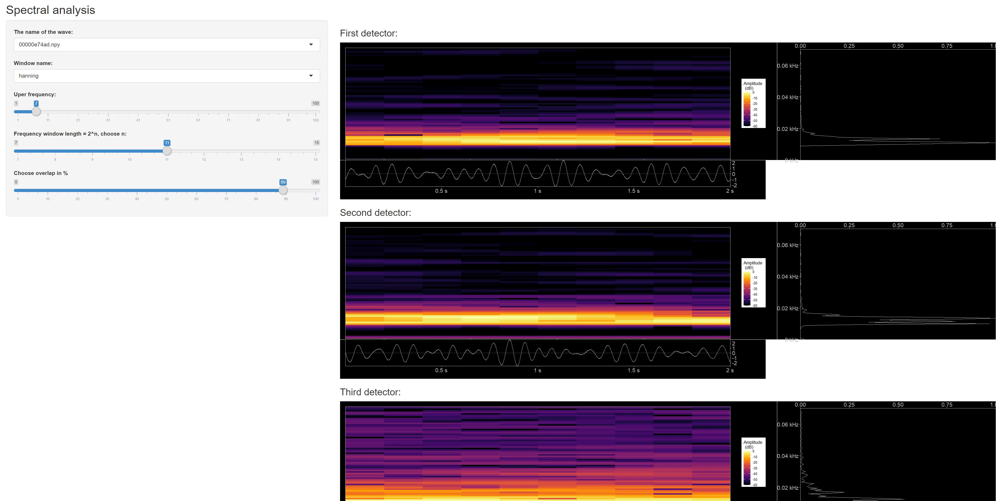

https://www.kaggle.com/c/g2net-gravitational-wave-detection/overview
we will use sound analysis to study these gravitational waves,

Nice book about sound analysis using R [](https://link.springer.com/book/10.1007/978-3-319-77647-7), it shows many examples for plotting spectorgrams

```{r setup, include=FALSE}
knitr::opts_chunk$set(echo = TRUE)

source('spectralAnalysisShinyApp/functions.R')
```

## R Markdown

Read file npy

```{r TimeAnalysis1}
library(RcppCNPy)
library(tidyverse)
library(tuneR)
library(seewave)

"00000e74ad.npy" %>% npyLoad() -> imat

imat %>%
  t() %>%
  as.data.frame() %>%
  rename( x =V1 , y = V2 , z = V3) %>%
  add_column( index = 1:(imat %>% ncol()) ) %>%
  gather( key, value , -index ) %>%
  ggplot( aes (y = value, x = index) ) +
  geom_line() +
  facet_grid(rows = vars(key)) +
  xlab("Time") + ylab("Intensity")


```


```{r  FrequencyAnlysis}
"00001f4945.npy" %>% readWaveFromNpy(1)  %>% spec( flim = c(0,0.03) )


```


## Including Plots

You can also embed plots, for example:

```{r  TimeFrequency1}

spectreTest <- function(fname) {
 fname %>% npyLoad() %>% scale()-> imat
  imat <- imat * 20
  imat %>%  .[2,] %>% Wave( left = .,samp.rate = 2048 )  %>%
          spectro( flim = c(0,0.2) , palette = colorRampPalette(c("white", "blue", "green")) , ovlp = 50)

}

"00001f4945.npy" %>% spectreTest()


```

similar to [example](https://rug.mnhn.fr/seewave/spec.html)
the code was copied form the above source, we have refactored it into different functions, to avoid occyping the memory with temporarly useless data
the result we are looking is to plot some graphs.

```{r TimeFrequency2}
 "00001f4945.npy" %>% readWaveFromNpy(2) %>% showPlots()

```


# shiny app for spectral analysis:
can be found in [folder](spectralAnalysisShinyApp)



# MFCC coefficients:


Calculate Frequency conversion and Filtering:
will apply some sound technique analysis, as frequencies domain is closer

```{r waveAuditorySpectrumScale}

waveAuditorySpectrumScale <- function( wave,wl = 512) {
  # sampling frequency
  fs <- wave@samp.rate
  #  Power spectrum using hamming window
   wave@left %>% powspec( sr=fs,wintime=wl/fs, steptime=wl/fs) %>%
#     frequency band conversion -> reduce frequencies to auditory frequency scale
        audspec(sr=fs, minfreq=0, maxfreq=fs/2,   nfilts=26, fbtype="htkmel")

}

scaleAndPlotAudSpecToMelFrequencies <- function(wave) {
  audspecWave <-  wave %>% waveAuditorySpectrumScale()
  fs <- wave@samp.rate
  # time scale
  at <- seq(0, 1, length=5)
  time <- round(seq(0, duration(wave), length=5), 1)
  # Hz frequency scale
  hz <- round(seq(fs/512, fs/2, length=5))
  # mel frequency scale
  mel <- hz %>%  hz2mel( htk=TRUE) %>% round()
  # plot
  par(mar=c(5.1, 4.1, 4.1, 4.1), las=1)
  col <- gray((512:0)/512)
  audspecWave$aspectrum %>% t() %>% image( col=col,
        axes=FALSE, xlab="Time (s)", ylab="Frequency (mel)")
  axis(side=1, at=at, labels=time)
  axis(side=2, at=at, labels=mel)
  axis(side=4, at=0:25/25, labels=1:26,)
  mtext("Mel-frequency filter #", side=4, las=0, line=2.5)
  abline(h=(0:25/25)+1/(25*2), col="lightgray")
  abline(v=(0:73/73)+1/(73*2), col="lightgray")
  box()
}

#"00001f4945.npy" %>% readWaveFromNpy(1) %>% waveAuditorySpectrumScale( ) %>% .$aspectrum  %>% image()
#"00001f4945.npy" %>% readWaveFromNpy(2) %>% waveAuditorySpectrumScale( ) %>% .$aspectrum  %>% image()
#"00001f4945.npy" %>% readWaveFromNpy(3) %>% waveAuditorySpectrumScale( ) %>% .$aspectrum  %>% image()

"00001f4945.npy" %>% readWaveFromNpy(1) %>% scaleAndPlotAudSpecToMelFrequencies()
"00001f4945.npy" %>% readWaveFromNpy(2) %>% scaleAndPlotAudSpecToMelFrequencies()
"00001f4945.npy" %>% readWaveFromNpy(3) %>% scaleAndPlotAudSpecToMelFrequencies()

```


Cepstral Coefficients

```{r Cepstral image}

cepstralCoefs <- function(wave) {
  audspecWave <-  wave %>%
    waveAuditorySpectrumScale() %>%
    .$aspectrum %>%
    spec2cep( ncep=13, type="t3")
}


"00001f4945.npy" %>% readWaveFromNpy(1) %>% cepstralCoefs() %>% .$cep %>% image()
"00001f4945.npy" %>% readWaveFromNpy(2) %>% cepstralCoefs() %>% .$cep %>% image()
"00001f4945.npy" %>% readWaveFromNpy(3) %>% cepstralCoefs() %>% .$cep %>% image()

```
scale and plot

```{r scaleAndPlotCepstralCoefs}
scaleAndPlotCepstralCoefs <- function(wave) {
  cepstralCoef <-  wave %>% cepstralCoefs()
  fs <- wave@samp.rate
  # time scale
  at <- seq(0, 1, length=5)
  time <- round(seq(0, duration(wave), length=5), 1)
  # Hz frequency scale
  hz <- round(seq(fs/512, fs/2, length=5))
  # mel frequency scale
  mel <- hz %>%  hz2mel( htk=TRUE) %>% round()
  # plot
  par(mar=c(5.1, 4.1, 4.1, 4.1), las=1)
  col <- gray((512:0)/512)
  cepstralCoef$cep %>%
    t() %>%
    image( col=col,axes=FALSE, xlab="Time (s)", ylab="Frequency (mel)")
  axis(side=1, at=at, labels=time)
  axis(side=2, at=at, labels=mel)
  axis(side=4, at=0:25/25, labels=1:26,)
  mtext("Mel-frequency filter #", side=4, las=0, line=2.5)
  abline(h=(0:25/25)+1/(25*2), col="lightgray")
  abline(v=(0:73/73)+1/(73*2), col="lightgray")
  box()
}


"00001f4945.npy" %>% readWaveFromNpy(1) %>% scaleAndPlotCepstralCoefs()
"00001f4945.npy" %>% readWaveFromNpy(2) %>% scaleAndPlotCepstralCoefs()
"00001f4945.npy" %>% readWaveFromNpy(3) %>% scaleAndPlotCepstralCoefs()

```

MFCC coeficients


```{r calculate mfcc and plot image}
mfccCoefs <- function(wave) {
  fs <- wave@samp.rate # sampling frequency
  wl <- 512 # STDFT window size
  ncep <- 13 # final number of MFCCs
  wave %>%
    preemphasis( alpha=0.97, output="Wave") %>%
    .@left %>%
    powspec( sr=fs, wintime=wl/fs, steptime=wl/fs) %>%
    audspec( sr=fs, nfilts=ncep*2, fbtype="htkmel") %>%
    .$aspectrum %>%
    spec2cep( ncep=ncep, type="t3") %>%
    .$cep %>%
    lifter( lift=ncep-1, htk=TRUE)
}

"00001f4945.npy" %>% readWaveFromNpy(1) %>% mfccCoefs() %>% image()
"00001f4945.npy" %>% readWaveFromNpy(2) %>% mfccCoefs() %>% image()
"00001f4945.npy" %>% readWaveFromNpy(3) %>% mfccCoefs() %>% image()
```

use melfcc function from tuneR package to calculate the coeficients

```{r iamge mfcc}
mfccCoefs2 <- function(wave) {
  wl <- 512
  ncep <- 13
  fs <- wave@samp.rate # sampling frequency
  wave %>%  melfcc( sr=fs,
                       wintime=wl/fs, hoptime=wl/fs,
                       numcep=ncep, nbands=ncep*2,
                       fbtype="htkmel", dcttype="t3",
                       htklifter=TRUE, lifterexp=ncep-1,
                       frames_in_rows=FALSE,
                       spec_out=TRUE)
}


"00001f4945.npy" %>% readWaveFromNpy(1) %>% mfccCoefs2() %>% .$cepstra %>% image()
"00001f4945.npy" %>% readWaveFromNpy(2) %>% mfccCoefs2() %>% .$cepstra %>% image()
"00001f4945.npy" %>% readWaveFromNpy(3) %>% mfccCoefs2() %>% .$cepstra %>% image()

```


Scale MFCC 13 coefficients and time to original and plot values in gery scale:

```{r scalePlotMfcc }
scalePlotMfcc <- function(wave) {
  ## time scale
  at <- seq(0, 1, length=5)
  time <- wave %>% duration() %>% seq(0, ., length=5) %>% round(1)
  ## plot
  # grey scale of colors
  col <- ((512:0)/512) %>% gray()
  par(las=1)
  wave %>%
    mfccCoefs2() %>%
    .$cepstra %>%
    t() %>%
    image(col=col,axes=FALSE, xlab="Time (s)", ylab="MFCC #")
  axis(side=1, at=at, labels=time)
  axis(side=2, at=0:12/12, labels=1:13)
  abline(h=(0:12/12)+1/(12*2), col="lightgray")
  abline(v=(0:73/73)+1/(73*2), col="lightgray")
  box()
}

"00001f4945.npy" %>% readWaveFromNpy(1) %>% scalePlotMfcc()
"00001f4945.npy" %>% readWaveFromNpy(2) %>% scalePlotMfcc()
"00001f4945.npy" %>% readWaveFromNpy(3) %>% scalePlotMfcc()

```


Use ggplot for the graphs 'geom_raster'

```{r ggplotMFCC }

ggplotMFCC <- function(wave) {
  signalDuration <- wave %>% duration()
  wave %>%
  mfccCoefs2() %>%
          .$cepstra %>%
          reshape2::melt() %>%
          mutate( Var2 = signalDuration * (Var2/max(Var2))  ) %>%
          ggplot( aes(x = Var2, y = Var1)) +
          geom_raster(aes(fill=value)) +
          scale_fill_gradientn(colours = ((512:0)/512) %>% gray()  ) +
          scale_x_continuous(n.breaks = 10) +
          scale_y_continuous(n.breaks=13) +
          labs(x="Time (s)", y="Coeficuents", title="MFCC coeficients") +
          theme_bw() +
          theme(axis.text.x=element_text(size=9, angle=0, vjust=0.3),
                axis.text.y=element_text(size=9),
                plot.title=element_text(size=11))
}


"00001f4945.npy" %>% readWaveFromNpy(1)   %>% ggplotMFCC()

```