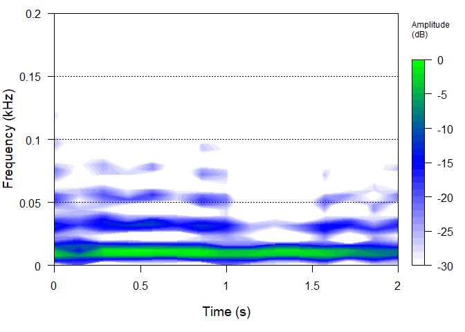

<https://www.kaggle.com/c/g2net-gravitational-wave-detection/overview>

Nice book about sound analysis using R
, it shows
many examples for plotting spectorgrams

## R Markdown

Read file npy

    library(RcppCNPy)

    ## Warning: package 'RcppCNPy' was built under R version 3.6.3

    library(tidyverse)

    ## -- Attaching packages --------------------------------------- tidyverse 1.3.0 --

    ## v ggplot2 3.3.3     v purrr   0.3.4
    ## v tibble  3.0.5     v dplyr   1.0.3
    ## v tidyr   1.1.2     v stringr 1.4.0
    ## v readr   1.4.0     v forcats 0.5.0

    ## Warning: package 'ggplot2' was built under R version 3.6.3

    ## Warning: package 'tibble' was built under R version 3.6.3

    ## Warning: package 'tidyr' was built under R version 3.6.3

    ## Warning: package 'readr' was built under R version 3.6.3

    ## Warning: package 'purrr' was built under R version 3.6.3

    ## Warning: package 'dplyr' was built under R version 3.6.3

    ## Warning: package 'forcats' was built under R version 3.6.3

    ## -- Conflicts ------------------------------------------ tidyverse_conflicts() --
    ## x dplyr::filter() masks stats::filter()
    ## x dplyr::lag()    masks stats::lag()

    library(tuneR)

    ## Warning: package 'tuneR' was built under R version 3.6.3

    library(seewave)

    ## Warning: package 'seewave' was built under R version 3.6.3

    ## 
    ## Attaching package: 'seewave'

    ## The following object is masked from 'package:readr':
    ## 
    ##     spec

    "00000e74ad.npy" %>% npyLoad() -> imat

    imat %>%
      t() %>%
      as.data.frame() %>%
      rename( x =V1 , y = V2 , z = V3) %>%
      add_column( index = 1:(imat %>% ncol()) ) %>%
      gather( key, value , -index ) %>%
      ggplot( aes (y = value, x = index) ) +
      geom_line() +
      facet_grid(rows = vars(key)) +
      xlab("Time") + ylab("Intensity")

    readWaveFromNpy <- function(filePath,index) {
      filePath %>%
              npyLoad() %>%
              .[index,] %>%
              scale()  %>%
              Wave( left = .,samp.rate = 2048 )

    }

    "00001f4945.npy" %>% readWaveFromNpy(1)  %>% spec( flim = c(0,0.03) )

    ## Warning in .local(left, ...): 'bit' not specified, assuming 16bit

## Including Plots

You can also embed plots, for example:

    "00001f4945.npy" %>% npyLoad() %>% scale()-> imat
    imat <- imat * 20
    imat %>%  .[2,] %>% Wave( left = .,samp.rate = 2048 )  %>%
      spectro( flim = c(0,0.2) , palette = colorRampPalette(c("white", "blue", "green")) , ovlp = 50)

    ## Warning in .local(left, ...): 'bit' not specified, assuming 16bit

similar to [example](https://rug.mnhn.fr/seewave/spec.html) the code was
copied form the above source, we have refactored it into different
functions, to avoid occyping the memory with temporarly useless data the
result we are looking is to plot some graphs.

    library(RcppCNPy)
    library(tidyverse)
    library(seewave)
    library(tuneR)
    library(ggplot2)
    library(viridis)

    ## Loading required package: viridisLite

    library(grid)
    library(gridExtra)

    ## 
    ## Attaching package: 'gridExtra'

    ## The following object is masked from 'package:dplyr':
    ## 
    ##     combine

    # x label formatter
    s_formatter <- function(x){
      lab <- paste0(x, " s")
    }

    # y label formatter
    khz_formatter <- function(y){
      lab <- paste0(y, " kHz")
    }

    buildDataFrameOfWave <- function(wav) {
      sample <- seq(1:length(wav@left))
      time <- sample/wav@samp.rate
      sample.left <- wav@left %>% cbind() %>% as.vector()
      sample %>% data.frame( time, sample.left)
    }

    buildSpectrograph <- function(wav) {
      hot_colors <- inferno(n=20)

      hot_theme_grid <- theme(panel.grid.major.y = element_line(color="black", linetype = "dotted"),
                              panel.grid.major.x = element_blank(),
                              panel.grid.minor = element_blank(),
                              panel.background = element_rect(fill="transparent"),
                              panel.border = element_rect(linetype = "solid", fill = NA, color = "grey"),

                              axis.line = element_blank(),

                              # legend.position = "top",
                              # legend.justification = "right",
                              # legend.background = element_rect(fill="black"),
                              # legend.key.width = unit(50, "native"),
                              # legend.title = element_text(size=16, color="grey"),
                              # legend.text = element_text(size=16, color="grey"),

                              plot.background = element_rect(fill="black"),
                              plot.margin = margin(1,1,0,1, "lines"),

                              axis.title = element_blank(),
                              axis.text = element_text(size=16, color = "grey"),
                              axis.text.x = element_blank(),
                              axis.ticks = element_line(color="grey"))

      wav %>%
              ggspectro( ovlp=90, flim=c(0,0.06), wl = 2048)+
              scale_x_continuous(labels=s_formatter, expand = c(0,0))+
              scale_y_continuous(breaks = seq(from = 5, to = 20, by=5), expand = c(0,0), labels = khz_formatter, position = "right")+
              geom_raster(aes(fill=amplitude), hjust = 0, vjust = 0, interpolate = F)+
              scale_fill_gradientn(colours = hot_colors, name = "Amplitude \n (dB)", na.value = "transparent", limits = c(-60,0))+
              hot_theme_grid

    }

    buildOscilograph <- function(df) {
      oscillo_theme_dark <- theme(panel.grid.major.y = element_line(color="black", linetype = "dotted"),
                                  panel.grid.major.x = element_blank(),
                                  panel.grid.minor = element_blank(),
                                  panel.background = element_rect(fill="transparent"),
                                  panel.border = element_rect(linetype = "solid", fill = NA, color = "grey"),
                                  axis.line = element_blank(),
                                  legend.position = "none",
                                  plot.background = element_rect(fill="black"),
                                  plot.margin = unit(c(0,1,1,1), "lines"),
                                  axis.title = element_blank(),
                                  axis.text = element_text(size=14, color = "grey"),
                                  axis.ticks = element_line(color="grey"))
        df %>%
              ggplot() +
              geom_line(mapping = aes(x=time, y=sample.left), color="grey")+
              scale_x_continuous(labels=s_formatter, expand = c(0,0))+
              scale_y_continuous(expand = c(0,0), position = "right")+
              geom_hline(yintercept = 0, color="white", linetype = "dotted")+
              oscillo_theme_dark
    }

    buildFFT <- function( wav ,upperFrequencyLimit = 0.06) {

      oscillo_theme_dark <- theme(panel.grid.major.y = element_line(color="black", linetype = "dotted"),
                                  panel.grid.major.x = element_blank(),
                                  panel.grid.minor = element_blank(),
                                  panel.background = element_rect(fill="transparent"),
                                  panel.border = element_rect(linetype = "solid", fill = NA, color = "grey"),
                                  axis.line = element_blank(),
                                  legend.position = "none",
                                  plot.background = element_rect(fill="black"),
                                  plot.margin = unit(c(0,0,0,0), "lines"),
                                  axis.title = element_blank(),
                                  axis.text = element_text(size=14, color = "grey"),
                                  axis.ticks = element_line(color="grey"))

              wav %>%
              spec(  plot = 0) %>%
              as.data.frame() %>%
              filter( x <= upperFrequencyLimit ) %>%
              ggplot() +
              geom_line(mapping = aes(x=x, y=y), color="grey")+
              scale_x_continuous(labels=khz_formatter, expand = c(0,0))+
              scale_y_continuous(expand = c(0,0), position = "right")+
              geom_hline(yintercept = 0, color="white", linetype = "dotted")+
                      coord_flip()+
              oscillo_theme_dark
    }

    #-------------------------------------------
    ## PLOT GRID
    #-------------------------------------------

    showPlotsInGrid <- function( hotplot , oscplot , fftPlot ) {
      gA <- hotplot %>% ggplot_build() %>% ggplot_gtable()
      gB <- oscplot %>% ggplot_build() %>% ggplot_gtable()
      gC <- fftPlot %>% ggplot_build() %>% ggplot_gtable()

      maxWidth = grid::unit.pmax(gA$widths, gB$widths)

      gA$widths <- as.list(maxWidth)
      gB$widths <- as.list(maxWidth)

      layo <- rbind(c(1,1,3),
                    c(1,1,3),
                    c(1,1,3),
                    c(2,2,NA))

      grid.newpage()
      grid.arrange(gA, gB,gC, layout_matrix = layo)
    }

    showPlots <- function(wav) {
       hotplot <- wav %>% buildSpectrograph()
       oscplot <- wav %>% buildDataFrameOfWave() %>% buildOscilograph()
       fftPlot <- wav %>% buildFFT()
      showPlotsInGrid( hotplot, oscplot,fftPlot)
    }

    "00001f4945.npy" %>% readWaveFromNpy(2) %>% showPlots()

    ## Warning in .local(left, ...): 'bit' not specified, assuming 16bit

    ## Scale for 'fill' is already present. Adding another scale for 'fill', which
    ## will replace the existing scale.

