# Kaggle’s competition:

The competition is about detecting gravitational waves in three signals
coming from three interferometre

We are interested in this competition, as the waves looks like a sound,
and we can apply some sound engineering technics, and some digital
signal processing to extract some features from the data, before apply
some deep learning to the models to train to predict the class of the
wave - ‘0’: if there is no sound analysis detected - ‘1’: if there is
one

the signal consist of three waves recording in three locations: - LIGO
Hanford, - LIGO Livingston - Virgo

the challenge of this data is that it needs many disciplines including
physics, digital signal processing, sound ingenerring and data science,
in my previous studies when I was junger, I studied some electrical
engeneering, it is a vey nice opportunity to remember some lessons
learned at that time,

it is kind of dream to work with such data, for a developer like me,
where getting data at work is some times impossible due to some
confidentiallity closes, where we can not freely to get the data to
apply some data science algorithms

we will use sound analysis to study these gravitational waves,

Nice book about sound analysis using R
, it shows
many examples for plotting spectorgrams

We group the function we build in [file](functions.R)

## R Markdown

Read data from the npy file, and plot them as time series with ggplot,
every npy file contains the three waves

    library(RcppCNPy)
    library(tidyverse)
    library(tuneR)
    library(seewave)

    "00000e74ad.npy" %>% npyLoad() -> imat

    imat %>%
      t() %>%
      as.data.frame() %>%
      rename( x =V1 , y = V2 , z = V3) %>%
      add_column( index = 1:(imat %>% ncol()) ) %>%
      gather( key, value , -index ) %>%
      ggplot( aes (y = value, x = index) ) +
      geom_line() +
      facet_grid(rows = vars(key)) +
      xlab("Time") + ylab("Intensity")

we plot the spectrogram of the time series wave, and we limit the
frequecy boundary of the plot from 0 to 0.03 khz

    "00001f4945.npy" %>% readWaveFromNpy(1)  %>% spec( flim = c(0,0.03) )

    ## Warning in .local(left, ...): 'bit' not specified, assuming 16bit

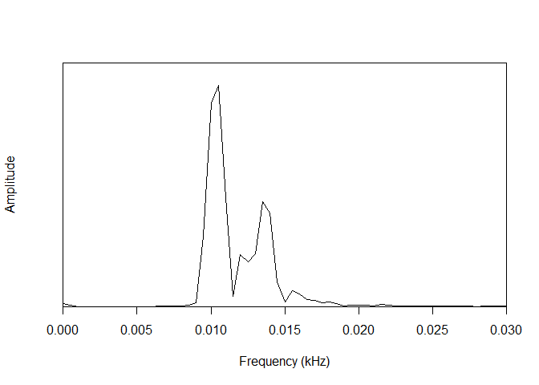

## Including Plots

You can also embed plots, for example:

    "00001f4945.npy" %>% spectreTest()

    ## Warning in .local(left, ...): 'bit' not specified, assuming 16bit

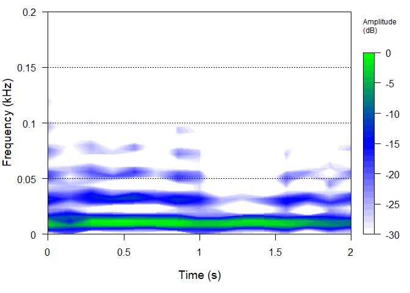

similar to [example](https://rug.mnhn.fr/seewave/spec.html) the code was
copied form the above source, we have refactored it into different
functions, to avoid occyping the memory with temporarly useless data the
result we are looking is to plot some graphs.

     "00001f4945.npy" %>% readWaveFromNpy(2) %>% showPlots()

    ## Warning in .local(left, ...): 'bit' not specified, assuming 16bit

    ## Scale for 'fill' is already present. Adding another scale for 'fill', which
    ## will replace the existing scale.

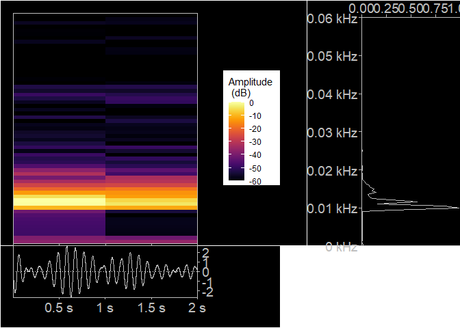

# shiny app for spectral analysis:

we use shiny applications in this project to explore visually the
differnt parameters of the R functions and algorithms, this allows to
find quickly the right tunning, and also understand the effect of every
parameter, we use drop down list with different possible parameters, as
well silders, can be found in [folder](spectralAnalysisShinyApp)

# MFCC coefficients:

Calculate Frequency conversion and Filtering: will apply some sound
technique analysis, as frequencies domain is closer

    "00001f4945.npy" %>% readWaveFromNpy(1) %>% scaleAndPlotAudSpecToMelFrequencies()

    ## Warning in .local(left, ...): 'bit' not specified, assuming 16bit

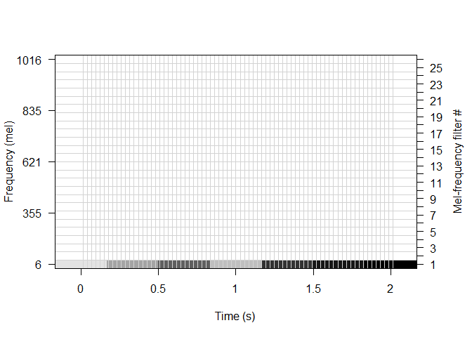

    "00001f4945.npy" %>% readWaveFromNpy(2) %>% scaleAndPlotAudSpecToMelFrequencies()

    ## Warning in .local(left, ...): 'bit' not specified, assuming 16bit

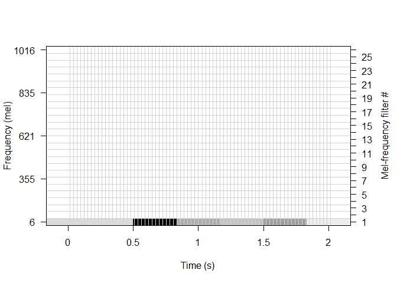

    "00001f4945.npy" %>% readWaveFromNpy(3) %>% scaleAndPlotAudSpecToMelFrequencies()

    ## Warning in .local(left, ...): 'bit' not specified, assuming 16bit

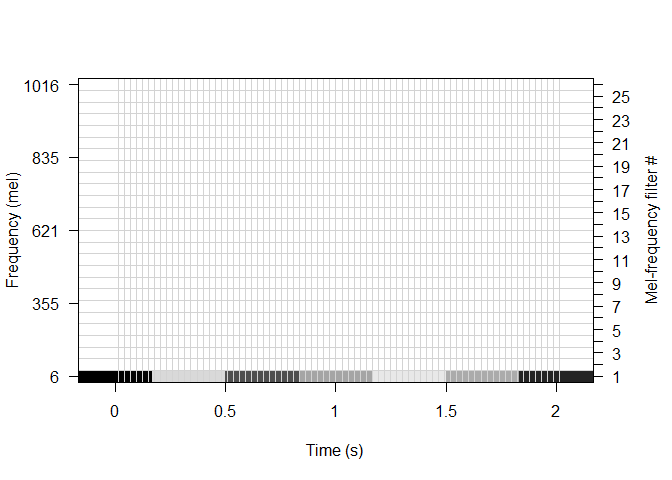

Cepstral Coefficients

    "00001f4945.npy" %>% readWaveFromNpy(1) %>% cepstralCoefs() %>% .$cep %>% image()

    ## Warning in .local(left, ...): 'bit' not specified, assuming 16bit

    "00001f4945.npy" %>% readWaveFromNpy(2) %>% cepstralCoefs() %>% .$cep %>% image()

    ## Warning in .local(left, ...): 'bit' not specified, assuming 16bit

    "00001f4945.npy" %>% readWaveFromNpy(3) %>% cepstralCoefs() %>% .$cep %>% image()

    ## Warning in .local(left, ...): 'bit' not specified, assuming 16bit

scale and plot

    "00001f4945.npy" %>% readWaveFromNpy(1) %>% scaleAndPlotCepstralCoefs()

    ## Warning in .local(left, ...): 'bit' not specified, assuming 16bit

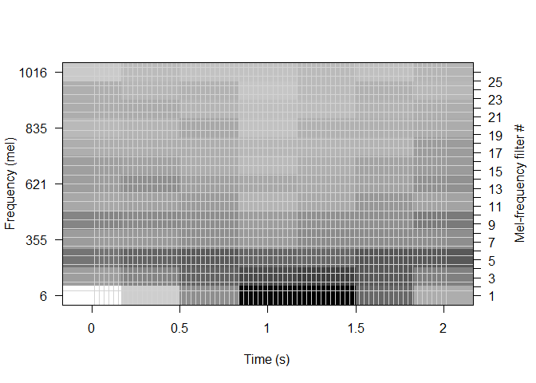

    "00001f4945.npy" %>% readWaveFromNpy(2) %>% scaleAndPlotCepstralCoefs()

    ## Warning in .local(left, ...): 'bit' not specified, assuming 16bit

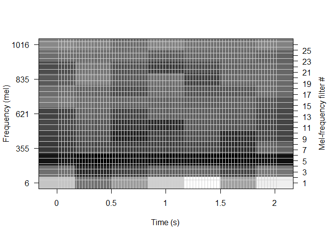

    "00001f4945.npy" %>% readWaveFromNpy(3) %>% scaleAndPlotCepstralCoefs()

    ## Warning in .local(left, ...): 'bit' not specified, assuming 16bit

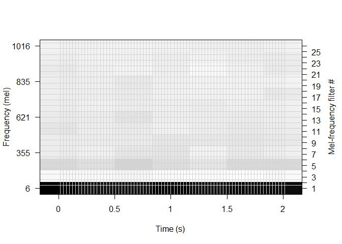

MFCC coeficients

    "00001f4945.npy" %>% readWaveFromNpy(1) %>% mfccCoefs() %>% image()

    ## Warning in .local(left, ...): 'bit' not specified, assuming 16bit

    "00001f4945.npy" %>% readWaveFromNpy(2) %>% mfccCoefs() %>% image()

    ## Warning in .local(left, ...): 'bit' not specified, assuming 16bit

    "00001f4945.npy" %>% readWaveFromNpy(3) %>% mfccCoefs() %>% image()

    ## Warning in .local(left, ...): 'bit' not specified, assuming 16bit

use melfcc function from tuneR package to calculate the coeficients

    "00001f4945.npy" %>% readWaveFromNpy(1) %>% mfccCoefs2() %>% .$cepstra %>% image()

    ## Warning in .local(left, ...): 'bit' not specified, assuming 16bit

    "00001f4945.npy" %>% readWaveFromNpy(2) %>% mfccCoefs2() %>% .$cepstra %>% image()

    ## Warning in .local(left, ...): 'bit' not specified, assuming 16bit

    "00001f4945.npy" %>% readWaveFromNpy(3) %>% mfccCoefs2() %>% .$cepstra %>% image()

    ## Warning in .local(left, ...): 'bit' not specified, assuming 16bit

Scale MFCC 13 coefficients and time to original and plot values in gery
scale:

    "00001f4945.npy" %>% readWaveFromNpy(1) %>% scalePlotMfcc()

    ## Warning in .local(left, ...): 'bit' not specified, assuming 16bit

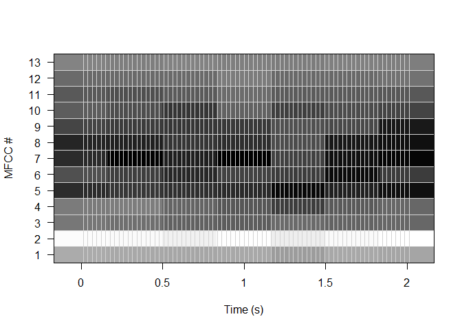

    "00001f4945.npy" %>% readWaveFromNpy(2) %>% scalePlotMfcc()

    ## Warning in .local(left, ...): 'bit' not specified, assuming 16bit

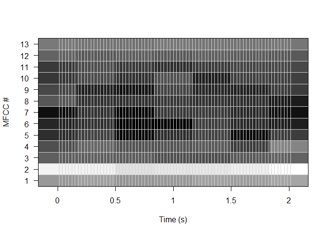

    "00001f4945.npy" %>% readWaveFromNpy(3) %>% scalePlotMfcc()

    ## Warning in .local(left, ...): 'bit' not specified, assuming 16bit

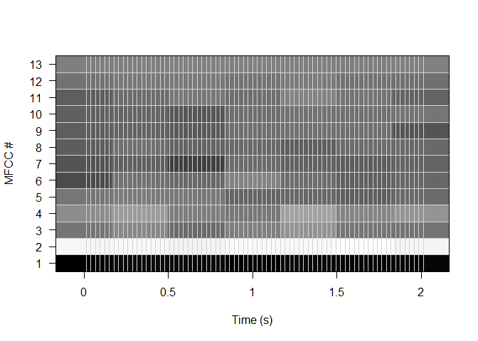

Use ggplot for the graphs ‘geom\_raster’

    "00001f4945.npy" %>% readWaveFromNpy(1)   %>% ggplotMFCC()

    ## Warning in .local(left, ...): 'bit' not specified, assuming 16bit

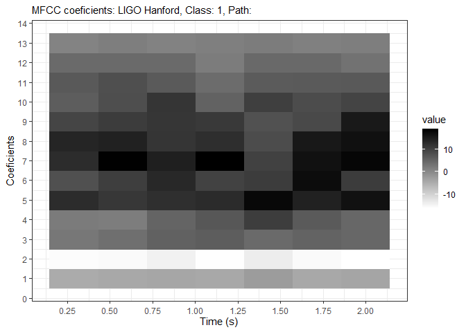

Generate csv file with name of .npy files, with their paths and category
type (1 : wave detected, 0: wave not detected )

    "../machineLearningData/gravitationalWaves/train" %>%
            list.files( recursive = T,full.names = T, include.dirs = F) %>%
            as_tibble() %>%
            mutate( id = value %>% str_sub(55) ) %>%
            rename(filePath = value) %>%
            inner_join(
                    "../machineLearningData/gravitationalWaves/train/ing_labels.csv" %>%
                            read.csv() %>%
                            as_tibble() %>%
                            mutate(id = paste0(id, ".npy") )
            ) %>%
            write.csv( file = "../machineLearningData/gravitationalWaves/train/file_labels.csv")

Produce animation of images of time frequency graphs using sample of
gravitational waves are detected, we will try with animation to detect
or see any feature from the data visual, the first sequence of MFCC
coefficients will be with only class data ‘1’, then class ‘0’ and
finally we produce a sequence switching between class 1 and class 0, so
to detect any difference visually as said.

Sequence of 20 images of class 1, we store them in
[folder](otherPictures/coefficientsClass1):

We produce the animation for the 20 images:

    "otherPictures/coefficientsClass1" %>% animateMFCCCoefPlots(waveClass = 1)

We can show the produced animation

we produce also images of coefficients of class 0, and we store them in
[folder](otherPictures/coefficientsClass0):

we produce animation with 5 of produced images:

    "otherPictures/coefficientsClass0" %>% animateMFCCCoefPlots(waveClass = 0)

We can show the produced animation

let’s produce animation with mix of coefficients pictures for class: ‘1’
and ‘0’

     "otherPictures/coefficientsClass0" %>%
      list.files(full.names = TRUE) %>%
      .[1:3] %>%
      rbind( "otherPictures/coefficientsClass1" %>% list.files(full.names = TRUE) %>% .[1:3] ) %>%
      c(.) %>%
      savePicturesAsAnimation( waveClass = 10 )

the animation of two classes 1 and 0 ( we used 3 images of each class)

# shiny application for MFCC coefficients:

to understand the different parterres of MFCC calculation, we build
another small shinny application: - the user can change the parameters
to see a better visualization - to find suitable values, of the
algorithm that we can use later the application is located at
[folder](mfccAnalysisShinyApp) it can run with file ‘run.R’

this is a screenshot of the application, to see how it looks like:

# Reduce dimensions of MFCC matrix for better visualization

Visually it is hard to see the difference between the waves containing
gravitation and the others, even with the animations techniques, it is
still undistinguished,

let’s do more: - we calculate the MFCC coefficients with suitable
parameters found with shiny application - repeat the above step for many
waves - reduce the dimension of the MFCC matrices using PCA - plot the
scatter plot that show in two different colors the two classes of data
this will be a good indicator whether MFCC features can be used to train
models

    calCulateMFCCMatrix <- function(wave) {

    }

    plot3DMFCCOneWave <- function(wave){
      options(rgl.useNULL = TRUE) # Suppress the separate window.
      library(rgl)
      rgl::setupKnitr(autoprint = TRUE)
      x <- sort(rnorm(1000))
      y <- rnorm(1000)
      z <- rnorm(1000) + atan2(x,y)
      plot3d(x, y, z, col = rainbow(1000))
      rglwidget()
    }

    plot3DMFCCOneWave()

    ## Warning: package 'rgl' was built under R version 3.6.3

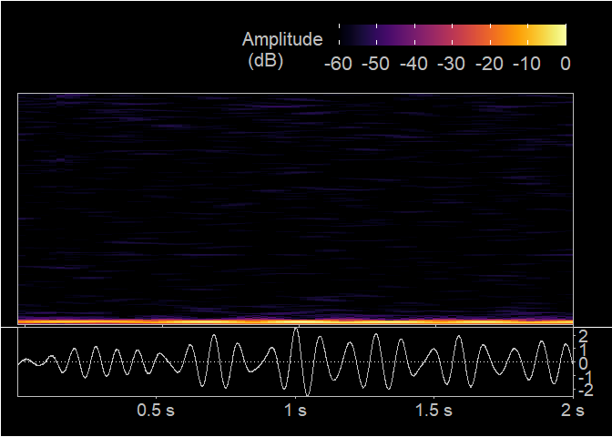
