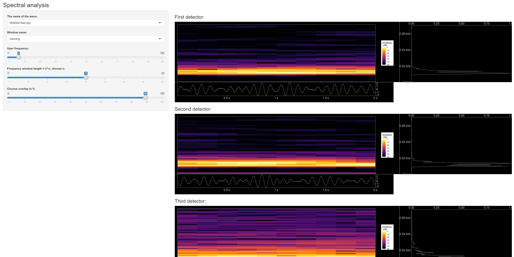

<https://www.kaggle.com/c/g2net-gravitational-wave-detection/overview>
we will use sound analysis to study these gravitational waves,

Nice book about sound analysis using R
, it shows
many examples for plotting spectorgrams

## R Markdown

Read file npy

    library(RcppCNPy)
    library(tidyverse)
    library(tuneR)
    library(seewave)

    "00000e74ad.npy" %>% npyLoad() -> imat

    imat %>%
      t() %>%
      as.data.frame() %>%
      rename( x =V1 , y = V2 , z = V3) %>%
      add_column( index = 1:(imat %>% ncol()) ) %>%
      gather( key, value , -index ) %>%
      ggplot( aes (y = value, x = index) ) +
      geom_line() +
      facet_grid(rows = vars(key)) +
      xlab("Time") + ylab("Intensity")

    "00001f4945.npy" %>% readWaveFromNpy(1)  %>% spec( flim = c(0,0.03) )

    ## Warning in .local(left, ...): 'bit' not specified, assuming 16bit

## Including Plots

You can also embed plots, for example:

    spectreTest <- function(fname) {
     fname %>% npyLoad() %>% scale()-> imat
      imat <- imat * 20
      imat %>%  .[2,] %>% Wave( left = .,samp.rate = 2048 )  %>%
              spectro( flim = c(0,0.2) , palette = colorRampPalette(c("white", "blue", "green")) , ovlp = 50)

    }

    "00001f4945.npy" %>% spectreTest()

    ## Warning in .local(left, ...): 'bit' not specified, assuming 16bit

similar to [example](https://rug.mnhn.fr/seewave/spec.html) the code was
copied form the above source, we have refactored it into different
functions, to avoid occyping the memory with temporarly useless data the
result we are looking is to plot some graphs.

     "00001f4945.npy" %>% readWaveFromNpy(2) %>% showPlots()

    ## Warning in .local(left, ...): 'bit' not specified, assuming 16bit

    ## Scale for 'fill' is already present. Adding another scale for 'fill', which
    ## will replace the existing scale.

# shiny app for spectral analysis:
can be found in [folder](spectralAnalysisShinyApp) 

# MFCC coefficients:

Calculate Frequency conversion and Filtering: will apply some sound
technique analysis, as frequencies domain is closer

    waveAuditorySpectrumScale <- function( wave,wl = 512) {
      # sampling frequency
      fs <- wave@samp.rate
      #  Power spectrum using hamming window
       wave@left %>% powspec( sr=fs,wintime=wl/fs, steptime=wl/fs) %>%
    #     frequency band conversion -> reduce frequencies to auditory frequency scale
            audspec(sr=fs, minfreq=0, maxfreq=fs/2,   nfilts=26, fbtype="htkmel")

    }

    scaleAndPlotAudSpecToMelFrequencies <- function(wave) {
      audspecWave <-  wave %>% waveAuditorySpectrumScale()
      fs <- wave@samp.rate
      # time scale
      at <- seq(0, 1, length=5)
      time <- round(seq(0, duration(wave), length=5), 1)
      # Hz frequency scale
      hz <- round(seq(fs/512, fs/2, length=5))
      # mel frequency scale
      mel <- hz %>%  hz2mel( htk=TRUE) %>% round()
      # plot
      par(mar=c(5.1, 4.1, 4.1, 4.1), las=1)
      col <- gray((512:0)/512)
      audspecWave$aspectrum %>% t() %>% image( col=col,
            axes=FALSE, xlab="Time (s)", ylab="Frequency (mel)")
      axis(side=1, at=at, labels=time)
      axis(side=2, at=at, labels=mel)
      axis(side=4, at=0:25/25, labels=1:26,)
      mtext("Mel-frequency filter #", side=4, las=0, line=2.5)
      abline(h=(0:25/25)+1/(25*2), col="lightgray")
      abline(v=(0:73/73)+1/(73*2), col="lightgray")
      box()
    }

    #"00001f4945.npy" %>% readWaveFromNpy(1) %>% waveAuditorySpectrumScale( ) %>% .$aspectrum  %>% image()
    #"00001f4945.npy" %>% readWaveFromNpy(2) %>% waveAuditorySpectrumScale( ) %>% .$aspectrum  %>% image()
    #"00001f4945.npy" %>% readWaveFromNpy(3) %>% waveAuditorySpectrumScale( ) %>% .$aspectrum  %>% image()

    "00001f4945.npy" %>% readWaveFromNpy(1) %>% scaleAndPlotAudSpecToMelFrequencies()

    ## Warning in .local(left, ...): 'bit' not specified, assuming 16bit

    "00001f4945.npy" %>% readWaveFromNpy(2) %>% scaleAndPlotAudSpecToMelFrequencies()

    ## Warning in .local(left, ...): 'bit' not specified, assuming 16bit

    "00001f4945.npy" %>% readWaveFromNpy(3) %>% scaleAndPlotAudSpecToMelFrequencies()

    ## Warning in .local(left, ...): 'bit' not specified, assuming 16bit

Cepstral Coefficients

    cepstralCoefs <- function(wave) {
      audspecWave <-  wave %>%
        waveAuditorySpectrumScale() %>%
        .$aspectrum %>%
        spec2cep( ncep=13, type="t3")
    }

    "00001f4945.npy" %>% readWaveFromNpy(1) %>% cepstralCoefs() %>% .$cep %>% image()

    ## Warning in .local(left, ...): 'bit' not specified, assuming 16bit

    "00001f4945.npy" %>% readWaveFromNpy(2) %>% cepstralCoefs() %>% .$cep %>% image()

    ## Warning in .local(left, ...): 'bit' not specified, assuming 16bit

    "00001f4945.npy" %>% readWaveFromNpy(3) %>% cepstralCoefs() %>% .$cep %>% image()

    ## Warning in .local(left, ...): 'bit' not specified, assuming 16bit

scale and plot

    scaleAndPlotCepstralCoefs <- function(wave) {
      cepstralCoef <-  wave %>% cepstralCoefs()
      fs <- wave@samp.rate
      # time scale
      at <- seq(0, 1, length=5)
      time <- round(seq(0, duration(wave), length=5), 1)
      # Hz frequency scale
      hz <- round(seq(fs/512, fs/2, length=5))
      # mel frequency scale
      mel <- hz %>%  hz2mel( htk=TRUE) %>% round()
      # plot
      par(mar=c(5.1, 4.1, 4.1, 4.1), las=1)
      col <- gray((512:0)/512)
      cepstralCoef$cep %>%
        t() %>%
        image( col=col,axes=FALSE, xlab="Time (s)", ylab="Frequency (mel)")
      axis(side=1, at=at, labels=time)
      axis(side=2, at=at, labels=mel)
      axis(side=4, at=0:25/25, labels=1:26,)
      mtext("Mel-frequency filter #", side=4, las=0, line=2.5)
      abline(h=(0:25/25)+1/(25*2), col="lightgray")
      abline(v=(0:73/73)+1/(73*2), col="lightgray")
      box()
    }

    "00001f4945.npy" %>% readWaveFromNpy(1) %>% scaleAndPlotCepstralCoefs()

    ## Warning in .local(left, ...): 'bit' not specified, assuming 16bit

    "00001f4945.npy" %>% readWaveFromNpy(2) %>% scaleAndPlotCepstralCoefs()

    ## Warning in .local(left, ...): 'bit' not specified, assuming 16bit

    "00001f4945.npy" %>% readWaveFromNpy(3) %>% scaleAndPlotCepstralCoefs()

    ## Warning in .local(left, ...): 'bit' not specified, assuming 16bit

MFCC coeficients

    mfccCoefs <- function(wave) {
      fs <- wave@samp.rate # sampling frequency
      wl <- 512 # STDFT window size
      ncep <- 13 # final number of MFCCs
      wave %>%
        preemphasis( alpha=0.97, output="Wave") %>%
        .@left %>%
        powspec( sr=fs, wintime=wl/fs, steptime=wl/fs) %>%
        audspec( sr=fs, nfilts=ncep*2, fbtype="htkmel") %>%
        .$aspectrum %>%
        spec2cep( ncep=ncep, type="t3") %>%
        .$cep %>%
        lifter( lift=ncep-1, htk=TRUE)
    }

    "00001f4945.npy" %>% readWaveFromNpy(1) %>% mfccCoefs() %>% image()

    ## Warning in .local(left, ...): 'bit' not specified, assuming 16bit

    "00001f4945.npy" %>% readWaveFromNpy(2) %>% mfccCoefs() %>% image()

    ## Warning in .local(left, ...): 'bit' not specified, assuming 16bit

    "00001f4945.npy" %>% readWaveFromNpy(3) %>% mfccCoefs() %>% image()

    ## Warning in .local(left, ...): 'bit' not specified, assuming 16bit

use melfcc function from tuneR package to calculate the coeficients

    mfccCoefs2 <- function(wave) {
      wl <- 512
      ncep <- 13
      fs <- wave@samp.rate # sampling frequency
      wave %>%  melfcc( sr=fs,
                           wintime=wl/fs, hoptime=wl/fs,
                           numcep=ncep, nbands=ncep*2,
                           fbtype="htkmel", dcttype="t3",
                           htklifter=TRUE, lifterexp=ncep-1,
                           frames_in_rows=FALSE,
                           spec_out=TRUE)
    }

    "00001f4945.npy" %>% readWaveFromNpy(1) %>% mfccCoefs2() %>% .$cepstra %>% image()

    ## Warning in .local(left, ...): 'bit' not specified, assuming 16bit

    "00001f4945.npy" %>% readWaveFromNpy(2) %>% mfccCoefs2() %>% .$cepstra %>% image()

    ## Warning in .local(left, ...): 'bit' not specified, assuming 16bit

    "00001f4945.npy" %>% readWaveFromNpy(3) %>% mfccCoefs2() %>% .$cepstra %>% image()

    ## Warning in .local(left, ...): 'bit' not specified, assuming 16bit

Scale MFCC 13 coefficients and time to original and plot values in gery
scale:

    scalePlotMfcc <- function(wave) {
      ## time scale
      at <- seq(0, 1, length=5)
      time <- wave %>% duration() %>% seq(0, ., length=5) %>% round(1)
      ## plot
      # grey scale of colors
      col <- ((512:0)/512) %>% gray()
      par(las=1)
      wave %>%
        mfccCoefs2() %>%
        .$cepstra %>%
        t() %>%
        image(col=col,axes=FALSE, xlab="Time (s)", ylab="MFCC #")
      axis(side=1, at=at, labels=time)
      axis(side=2, at=0:12/12, labels=1:13)
      abline(h=(0:12/12)+1/(12*2), col="lightgray")
      abline(v=(0:73/73)+1/(73*2), col="lightgray")
      box()
    }

    "00001f4945.npy" %>% readWaveFromNpy(1) %>% scalePlotMfcc()

    ## Warning in .local(left, ...): 'bit' not specified, assuming 16bit

    "00001f4945.npy" %>% readWaveFromNpy(2) %>% scalePlotMfcc()

    ## Warning in .local(left, ...): 'bit' not specified, assuming 16bit

    "00001f4945.npy" %>% readWaveFromNpy(3) %>% scalePlotMfcc()

    ## Warning in .local(left, ...): 'bit' not specified, assuming 16bit

Use ggplot for the graphs ‘geom\_raster’

    ggplotMFCC <- function(wave) {
      signalDuration <- wave %>% duration()
      wave %>%
      mfccCoefs2() %>%
              .$cepstra %>%
              reshape2::melt() %>%
              mutate( Var2 = signalDuration * (Var2/max(Var2))  ) %>%
              ggplot( aes(x = Var2, y = Var1)) +
              geom_raster(aes(fill=value)) +
              scale_fill_gradientn(colours = ((512:0)/512) %>% gray()  ) +
              scale_x_continuous(n.breaks = 10) +
              scale_y_continuous(n.breaks=13) +
              labs(x="Time (s)", y="Coeficuents", title="MFCC coeficients") +
              theme_bw() +
              theme(axis.text.x=element_text(size=9, angle=0, vjust=0.3),
                    axis.text.y=element_text(size=9),
                    plot.title=element_text(size=11))
    }

    "00001f4945.npy" %>% readWaveFromNpy(1)   %>% ggplotMFCC()

    ## Warning in .local(left, ...): 'bit' not specified, assuming 16bit

